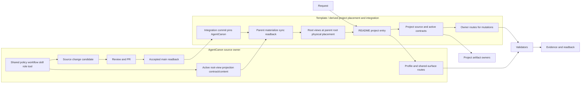

# Project Template
<!--
@dependency-start
contract design
responsibility Documents Project Template for this repository.
upstream design AGENTS.md agent runtime entrypoint
upstream design LICENSE repository license text
upstream design vendor/agent-canon/CONTAINER_OPERATIONS.md AgentCanon container and devcontainer operation rulebook
downstream design QUICK_START.md quick-start reader path
downstream design documents/contracts/licensing-policy.md repository license boundary
@dependency-end
-->

> [!IMPORTANT]
> MCP server は起動成功率が低めです。MCP 前提の作業では、起動している前提で進めず、最初に接続状態と利用可否を確認してください。

> [!IMPORTANT]
> subagent と skill の起動を甘くしないでください。task が subagent / skill を要求する場合は、parent の手作業や暗黙 fallback で代替せず、必要 surface を明示して機械的に起動してください。未起動なら、その事実を最初に確認してから進めます。

実装、文書、必要に応じた実験・エージェント運用を 1 つの repo で扱うためのテンプレートです。
base profile は Python 実装と Markdown 文書を想定しますが、Docker、C++、実験、GitHub automation、memory は opt-in profile です。

この README は人間向けの入口です。Codex の自動 instruction chain は
Codex home の global guidance を読んだ後、project root から current working
directory までの `AGENTS.override.md` / `AGENTS.md` / configured fallback file
で決まります。この template で最上位の repo instruction surface は
`AGENTS.md` です。workflow、skill、runtime の canonical source は
`vendor/agent-canon/agents/` と `vendor/agent-canon/documents/` から読みます。

## この文書の読み方

- この README は、template repo の構造、基本方針、clone 後の進め方、日常コマンドの入口を扱います。
- `全体設計` で Template と AgentCanon の owner 境界・配布境界を確認してから、`テンプレート構造` と `基本方針` を読みます。clone、初期手順、実験、Docker、詳細入口は目的別 section を読みます。
- 新規 clone、派生 repo の立ち上げ、どの正本文書へ進むかを決めるときに最初に読みます。

## 全体設計

この section は Template と派生 project の構成、所有境界、実行ライフサイクルを読むための
非規範的な overview です。実行、責務、profile、artifact、配布の契約は、親 root の
[`AGENTS.md`](AGENTS.md)、その backing view である
[`vendor/agent-canon/ROOT_AGENTS.md`](vendor/agent-canon/ROOT_AGENTS.md)、および
AgentCanon の owner document がそれぞれ所有します。この section は正本を複製せず、
次に読む入口を示します。

### 責務境界

Template は project domain の source、active contract、そして AgentCanon を pin する
integration commit を所有します。AgentCanon source は shared runtime の policy、workflow、
skill、role、tool、validation contract と、`AGENTS.md`、`.codex`、tools view の active
root-view projection contract/content を所有します。親 root の `AGENTS.md` は
`vendor/agent-canon/ROOT_AGENTS.md` に基づく runtime view です。これらの view は親 root に
物理配置されますが、Template が直接編集する別の instruction canon ではありません。親側は
owner route に従って view を materialize、sync、readback します。

Runtime profile の reader route は
[Runtime Profiles And Check Matrix](vendor/agent-canon/documents/runtime/runtime-profiles-and-check-matrix.md)、
その機械可読 canonical source は
[runtime-profiles-and-check-matrix.json](vendor/agent-canon/documents/runtime/runtime-profiles-and-check-matrix.json)
です。Shared surface の reader route は
[Shared Runtime Surfaces](vendor/agent-canon/documents/runtime/SHARED_RUNTIME_SURFACES.md)、
その機械可読 canonical source は
[shared-runtime-surfaces.toml](vendor/agent-canon/documents/runtime/shared-runtime-surfaces.toml)
です。Runtime の詳細な workflow、subagent、communication contract は
[`CODEX_WORKFLOW.md`](vendor/agent-canon/agents/canonical/CODEX_WORKFLOW.md)、
[`CODEX_SUBAGENTS.md`](vendor/agent-canon/agents/canonical/CODEX_SUBAGENTS.md)、
[`COMMUNICATION_PROTOCOL.md`](vendor/agent-canon/agents/COMMUNICATION_PROTOCOL.md) を読みます。

### 設計目的

Project Template は、project 固有の source、検証、文書、実験、開発環境と、共有
Agent runtime を一つの repository root から扱う composition root です。完成済み
application の構造を固定するのではなく、選択した runtime profile に必要な surface を
組み合わせられる出発点を提供します。

設計上の中心は、project 固有の責務と AgentCanon が所有する共有責務を分離し、
`vendor/agent-canon` を pin する integration commit と AgentCanon の root-view projection
contract で接続することです。これにより、
派生 project は domain code と active contract を所有しながら、同じ AgentCanon revision
から workflow、skill、hook、共有 tool を再現できます。

### システムモデル



`AGENTS.md`、`vendor/agent-canon/ROOT_AGENTS.md`、profile route、shared-surface route は
reader と owner をつなぐ入口です。`AGENTS.md` などの root view は親 root に配置されますが、
その projection contract/content は AgentCanon が所有し、親側は materialization、sync、
readback の operation を行います。Validators は変更の property を確認して evidence と
readback を生成しますが、mutation の代替にはなりません。変更は選択された owner route
から行い、profile と touched surface に対応する validation だけを実行します。

### タスクの流れ

以下は Template / derived project の変更を読むための概要です。具体的な workflow、skill、
review、validation は選択した profile と touched surface に従って決まり、この README の
一律 checklist ではありません。

1. Root entrypoint が user request と現在の構造を読み、project domain、shared runtime、
   変更対象の owner を区別します。
1. Active contract と runtime profile の reader route を読み、設計、実装、validation の
   対応を決めます。機械可読な TOML / JSON はその判断を実行へ伝える canonical source です。
1. Project source、active contract、AgentCanon source の変更は、それぞれの owner route で
   行います。Template 側の integration commit は AgentCanon pin を固定し、親側の route が
   root view を materialize、sync、readback します。Validator は finding、evidence、readback
   を返します。
1. Project artifact、report、experiment result、runtime evidence は対応する artifact
   owner が管理します。全 surface に一律の retention policy があるとは限りません。
1. AgentCanon source の更新が必要な場合は、AgentCanon 側の source change、review、main
   readback の後に、Template 側で pin を固定する integration commit を作成し、親側の route
   で root view を materialize、sync、readback します。

### 配布境界

Template と derived repository は、project 固有の source、active contract、開発環境、
experiment、project artifact、そして `vendor/agent-canon` を pin する integration commit
を所有します。AgentCanon repository は shared policy、workflow、skill、role、tool、validation
contract の source と、`AGENTS.md`、`.codex`、tools view の active root-view projection
contract/content を所有します。これらの view は親 root に物理配置されますが、親側は owner
route に従って materialize、sync、readback し、view の内容を直接編集しません。Template は
AgentCanon source を複製せず、integration commit と materialized root view から必要な runtime
surface を公開します。

Generated runtime view、validator evidence、run report、experiment result、memory、notes
は、それぞれの owner が定める surface で扱います。これらを一つの retention policy に
まとめたり、README や設計正本の代替にしたりしません。配布と root view の reader/owner
route は [Shared Runtime Surfaces](vendor/agent-canon/documents/runtime/SHARED_RUNTIME_SURFACES.md)、
その機械可読 canonical source は
[shared-runtime-surfaces.toml](vendor/agent-canon/documents/runtime/shared-runtime-surfaces.toml)
です。利用能力と検証範囲の reader/owner route は
[Runtime Profiles And Check Matrix](vendor/agent-canon/documents/runtime/runtime-profiles-and-check-matrix.md)、
その機械可読 canonical source は
[runtime-profiles-and-check-matrix.json](vendor/agent-canon/documents/runtime/runtime-profiles-and-check-matrix.json)
です。

### 設計上の不変条件

- Template / derived repository は project domain、active contract、そして AgentCanon を pin する integration commit を所有します。
- AgentCanon は shared runtime source と `AGENTS.md`、`.codex`、tools view の active root-view projection contract/content を所有します。これらは親 root に物理配置されます。
- 親 root の `AGENTS.md` は `vendor/agent-canon/ROOT_AGENTS.md` に基づく view であり、親側は owner route に従って materialize、sync、readback します。親側はその内容を直接編集しません。
- Runtime profile と shared surface の Markdown は reader route、TOML / JSON は機械可読 canonical source として対応します。
- Validator は evidence / readback を生成し、mutation は選択された owner route から行います。
- Project 固有の code、config、active contract、artifact は AgentCanon の shared source に取り込みません。
- AgentCanon source の変更は source 側の review / main readback を経てから Template の integration commit に pin され、親側の route で root view が materialize、sync、readback されます。
- Artifact、report、log、experiment output の保持期間は owner ごとに決まり、全 surface に一律の retention policy を置きません。

## テンプレート構造の例

この repo は、project 固有の実装、実験、文書、開発環境、agent runtime を同じ root から扱えるように分けています。以下は利用可能な surface の例であり、親レポに要求する十分条件や完全な tree ではありません。必要条件は AgentCanon の shared surface manifest と親レポの owner document だけで確認します。
clone 直後にまず見る入口はこの README、Codex repo instruction chain の最上位入口は `AGENTS.md`、実際の初期化入口は `scripts/start_repository.sh` です。

```text
.
├── README.md                         # 人間向けの全体入口
├── QUICK_START.md                    # 最短の手動起動手順
├── AGENTS.md                         # Codex repo instruction view。AgentCanon pin への symlink
├── Makefile                          # 日常 check / bootstrap / validation の短い入口
├── pyproject.toml                    # Python project metadata と tool 設定
├── cpp/                              # C++ profile の単一 project root
│   ├── CMakeLists.txt                # C++ project entrypoint
│   ├── include/                      # public header
│   ├── src/                          # production source
│   ├── tests/                        # CTest consumers
│   └── experiments/                  # native experiment targets
├── python/                           # Python 実装本体
├── tests/                            # pytest と runtime/tooling のテスト
├── documents/                        # repo-local index, active contracts, and project docs
├── notes/                            # durable knowledge profile のテーマ別メモ
├── references/                       # research profile の外部仕様や補助資料
├── .codex/                           # project-local Codex config と AgentCanon config view
├── vendor/agent-canon/               # shared agent canon の Git submodule pin
├── tools/                            # 親所有の regular tool container
│   └── agent-canon/                   # shared automation view。vendor への symlink
├── scripts/                          # repo-local bootstrap 専用 script
├── docker/                           # Docker runtime profile の元設定
├── .devcontainer/                    # 親所有の regular devcontainer overlay
│   └── post-create-parent.sh
├── .github/                          # GitHub automation profile の workflow と PR template
├── experiments/                      # experiment profile の topic、artifact、report
├── reports/                          # ignored runtime artifact / agent run bundle の生成先
└── .vscode/                          # 親所有の regular editor profile 設定
```

### Runtime Profiles

この template は surface を最初から持ちますが、全 surface が常時必須ではありません。
profile と validation の正本は
[Runtime Profiles And Check Matrix](vendor/agent-canon/documents/runtime/runtime-profiles-and-check-matrix.md)
です。

- Base project: README、QUICK_START、documents index、project code/tests。
- Agent runtime: `AGENTS.md`、`.codex/config.toml`、shared `tools/agent-canon/`。canonical workflow / skill は `vendor/agent-canon/agents/` から読みます。
- Environment: `docker/`、`.devcontainer/`、runtime packs、Jupyter。
- GitHub automation: `.github/`、Actions、PR templates。
- Experiment / research: `experiments/`、`references/`、managed run artifacts。
- C++: `cpp/CMakeLists.txt`、`cpp/cmake/`、`cpp/src/`、`cpp/include/`、`cpp/tests/`、`cpp/experiments/`。
- Memory / notes: `memory/`、`notes/`、learning or durable feedback capture。

### Repo-Local と Shared Canon の境界

- `documents/`
  - repo-local index、template-owned active contract、project-owned design doc を置きます。
  - `documents/README.md` は repo-local 目次です。shared workflow / coding / review policy は `vendor/agent-canon/documents/` の AgentCanon 正本から読み、bootstrap / host / server contract は template または derived repo の regular file として扱います。
- `notes/`
  - 実験や調査をまたいで残したい知見、補助メモ、テーマ整理を置きます。
  - その場限りの run log ではなく、後続作業で再利用する知識だけを残します。memory / learning profile が active な時だけ closeout 対象にします。
- `tools/agent-canon/`
  - shared automation、agent helper、CI/check、container runner の入口です。
  - agent helper、CI / review / validation、container runner、experiment helper、Markdown helper の実装はここに置きます。
  - root の `tools/agent-canon/` は `vendor/agent-canon/tools` への symlink です。project 固有の slug 置換や bare remote 初期化はここに置きません。
- `tools/` のうち `agent-canon` 以外は template または derived project が所有する regular tooling です。shared automation の source は `vendor/agent-canon/tools/` に置きます。
- `scripts/`
  - repo-local bootstrap の入口です。
  - template 固有の slug 置換、display name 置換、bare remote 初期化だけをここに置きます。
  - `$start-repository` skill は `scripts/start_repository.sh` を呼び、その wrapper が clean clone では init 前の `make agent-canon-update`、`scripts/init_from_template.sh`、必要な post-commit validation をまとめます。`--force` を init に渡すと wrapper preflight は block 扱いで skip し、dirty override を邪魔しません。
- `docker/`
  - Docker runtime profile、runtime pack、notebook profile の定義です。
  - Dockerfile、requirements、pack toml はここに集めます。Codex / GitHub CLI / auth / mount ergonomics は Dockerfile ではなく managed devcontainer に置き、親の regular overlay と AgentCanon の shared runtime config を分担させます。
  - Docker を使わない repo では supported runtime の一つとして扱い、日常 validation からは外して構いません。
- `.devcontainer/` と `.vscode/`
  - devcontainer と editor の設定は親 repo が所有する regular file です。AgentCanon の root projection には含めず、必要な project-specific overlay をここへ置きます。
- `experiments/`
  - experiment profile の実験コード、run ごとの生成物、report を置く場所です。使わないプロジェクトでは空でも構いません。
  - topic 一覧は `experiments/registry.toml`、AgentCanon source template は `vendor/agent-canon/templates/experiments/_template/`、run report は `experiments/report/` に置きます。
- `python/`
  - 実装本体、共通 runtime、テスト対象コードの主置き場です。
- `tests/`
  - pytest ベースのテストを置く場所です。
  - `tests/agent_tools/` と `tests/tools/` は AgentCanon-owned shared-runtime test、`tests/project/` や package-specific tests は project-local implementation test です。

### Bootstrap と Validation の入口

- `make start-repository ARGS='--project-slug your-project --display-name "Your Project"'`
  - clone 直後の推奨入口です。内部で `scripts/start_repository.sh` を呼びます。
- `bash scripts/start_repository.sh --validate-only`
  - init 変更を commit したあと、`agent-canon` latest check と fresh clone acceptance だけを read-only で確認します。
- `make agent-canon-update`
  - 派生 repo から `agent-canon` だけ更新します。内部では `make agent-canon` の `ARGS='tools/update_agent_canon.sh latest'` を呼ぶ route です。
- `make agent-canon ARGS='tools/sync_agent_canon.sh link-root'`
  - 親 root shared surface を再リンクします。
- `make agent-canon ARGS='tools/sync_agent_canon.sh check'`
  - 共有 surface drift の read-only チェックをします。
- `make ci-quick`
  - docs、experiment registry、pytest、pyright、pydocstyle を流します。通常の smoke 入口ですが、変更種別に応じた最小 check matrix を優先して構いません。
- C++ の日常入口は `make CPP_PROFILE=dev cpp-test`（configure/build 後に CTest）と `make CPP_PROFILE=dev cpp-install`（configure/build 後に install）です。CMake graph の詳細は `cpp/README.md` を参照します。

## 基本方針

- 既定の統合先は `main` です。恒常的な複数 branch 運用はしません。
- 短期 branch は必要なときだけ切り、整理が済んだら `main` に戻します。
- branch 側で file 構成を変えた場合は、`vendor/agent-canon/agents/workflows/main-integration-workflow.md` の integration worktree 手順で `main` へ戻します。
- tracked tree に残す durable state は current tree head の canonical path だけです。旧実装、移行用の別経路、`*_old`、`*_copy`、dated snapshot、backup file、古い説明を残した文書を tracked tree に置きません。ただし `reports/` の run/date/base/pin identity と「current を保証しない」警告を持つ immutable historical evidence（#150 の historical report など）は、旧説明や backup ではなく履歴 evidence として明示的な例外です。
- 実装を変えたら、その実装を説明する README、guide、workflow、規約文書も同じ変更で最新実装に合わせます。古い挙動の説明を追記で温存せず、不要になった記述は削除または正本へ置換します。
- 大規模改修、rename、構成変更のあとには、旧実装 path、旧 helper 名、旧文書 path への参照を README、guide、workflow、規約文書、script help から除去し、reader が最新 surface 以外に誘導されない状態までそろえます。
- `documents/` には正本だけを置きます。履歴説明や日付付きの途中報告は置きません。
- 実装変更では、必要なテストと文書更新を同じ変更でそろえます。
- 実験は 1 回の run を fresh 実行として扱い、途中停止 run を正式結果として継ぎ足しません。
- Python の静的解析とテスト、Markdown の体裁とリンク確認は、該当 path を変更した時の日常 check に含めます。
- `psutil`、`pipdeptree`、`deptry`、`snakeviz` は observability / dependency / performance profile の tool です。全 repo の baseline requirement としては扱いません。
- repo-local `.venv` は template default では host に作らず、container 内だけ `python3 tools/agent-canon/ci/python_env_policy.py --create` で `.venv` を許可します。派生 repo が host venv を採用する場合は project-local environment policy で明示します。

shared agent canon は `vendor/agent-canon/` の Git submodule pin として参照します。clone 時は submodule も取得し、active な root projection は `AGENTS.md`、`.codex/config.toml`、`tools/agent-canon` だけです。`.devcontainer/`、`.vscode/`、その他の `tools/` は親 repo が所有する regular content です。ownership と surface 種別は [SHARED_RUNTIME_SURFACES.md](vendor/agent-canon/documents/runtime/SHARED_RUNTIME_SURFACES.md) を正本にし、`.github/workflows/agent-coordination.yml` と `.github/PULL_REQUEST_TEMPLATE/agent_canon.md` は symlink ではなく vendor 正本から同期する root copy として扱います。

## Clone And AgentCanon Update

新規 clone は submodule 込みで取得します。

```bash
git clone --recurse-submodules <template-url> <repo>
cd <repo>
```

submodule なしで clone した場合、または `vendor/agent-canon/` が空の場合は次で復旧します。

```bash
git submodule sync vendor/agent-canon
git submodule update --init --recursive vendor/agent-canon
PYTHONPATH=vendor/agent-canon/tools:tools python3 -m agent_tools.agent_canon_source_root exec tools/sync_agent_canon.sh check
```

AgentCanon の URL や branch 情報が `.gitmodules` と submodule config でずれた場合は `git submodule sync vendor/agent-canon` を先に実行します。submodule worktree が stale / detached / local-only commit を含む場合は、親 repo の tree diff ではなく `vendor/agent-canon/` の branch / status を確認します。local commit がある branch は generic source-root dispatcher から `tools/update_agent_canon.sh merge-main-into-current` を実行して GitHub `main` を取り込んでから GitHub へ push し、AgentCanon PR にします。

AgentCanon の更新順序は、AgentCanon repo を更新して push / PR merge、template の `vendor/agent-canon` pin 更新、generic source-root dispatcher から `tools/sync_agent_canon.sh link-root`、validation、template commit / push です。`.gitmodules` は template runtime contract の一部なので、AgentCanon URL や branch に関わる PR では必ず確認します。AgentCanon GitHub `main`、template GitHub `origin/main`、submodule pin SHA を PR や closeout で混同しません。

## まず読むもの

- `QUICK_START.md`
- Codex runtime instruction を確認する場合は `AGENTS.md`
- `documents/README.md`
- `vendor/agent-canon/documents/runtime/runtime-profiles-and-check-matrix.md`
- clone/bootstrap を触る場合は `documents/contracts/template-bootstrap.md`
- agent workflow / skill を確認する場合は `vendor/agent-canon/agents/README.md` と `vendor/agent-canon/agents/workflows/README.md`
- Python を触る場合は `vendor/agent-canon/documents/conventions/coding-conventions-python.md`
- C++ を触る場合は `vendor/agent-canon/documents/design/cpp-build-layout.md`
- 開発環境を触る場合は `docker/` と `vendor/agent-canon/CONTAINER_OPERATIONS.md`
- host 前提を確認する場合は `documents/contracts/linux-wsl-host-requirements.md`
- 実験を行う場合は `vendor/agent-canon/agents/workflows/experiment-workflow.md`
- 実験 topic を作る場合は `experiments/README.md`
- topic registry を触る場合は `vendor/agent-canon/documents/experiments/experiment-registry.md`

## 日常の進め方

1. 何を変えるかを決めます。実装だけか、実験まで含むか、環境や文書更新が必要かを構造と owner surface から決めます。
1. 変更前に必要な baseline を決めます。docs だけの修正なら status と docs check、Python 変更なら targeted pytest / pyright / ruff、shared canon 変更なら AgentCanon PR gate を選びます。
1. 実装、実験コード、文書、必要なら `docker/` を更新します。
1. 仕上げに changed path と risk class に合った個別チェック、または full confidence が必要なら `make ci` を流します。
1. 長期に残す判断や実験知見は `notes/` に移し、正本ルールは `documents/` に反映します。

## 新規 clone 直後の最短手順

```bash
bash scripts/start_repository.sh --project-slug your-project --display-name "Your Project"
git add -A
git commit -m "chore: initialize project from template"
bash scripts/start_repository.sh --validate-only
```

初期化時の AgentCanon 正本は GitHub submodule です。shared canon の差分は `vendor/agent-canon/` 内の GitHub branch に commit し、AgentCanon PR で戻します。

最短 runbook は `documents/contracts/template-bootstrap.md`、notes を育てる方針は `vendor/agent-canon/documents/operations/notes-lifecycle.md` を見ます。

## 実験を含むプロジェクトでの使い方

新規実験は次のような配置を基準にします。

```text
experiments/
├── registry.toml
├── report/
│   └── <run_name>.md
└── <topic>/
    ├── README.md
    ├── cases.*
    ├── experiment.*
    └── result/
        └── <run_name>/
```

- 1 回の run の report は `experiments/report/<run_name>.md`
- run ごとの生成物は `experiments/<topic>/result/<run_name>/`
- 複数 run をまたぐ知見は `notes/experiments/` または `notes/themes/`

実験方法論そのものは `vendor/agent-canon/agents/workflows/experiment-workflow.md` と `vendor/agent-canon/agents/workflows/research-workflow.md` を正本にします。
agent に実験つき改造 loop を回させる場合は `vendor/agent-canon/agents/skills/adaptive-improvement-loop.md` を outer loop、`vendor/agent-canon/agents/skills/experiment-lifecycle.md` を run 単位の分岐に使います。
server で回す実験コードの実体は AgentCanon source template `vendor/agent-canon/templates/experiments/_template/`、topic 正本は `experiments/registry.toml`、topic scaffold は `tools/agent-canon/experiments/create_experiment_topic.py`、run metadata を残す入口は `tools/agent-canon/experiments/run_managed_experiment.py` です。

## よく使うコマンド

```bash
make check-matrix
make docs-check
python3 -m pytest tests/ -q --tb=short
python3 -m pyright
python3 -m ruff check python tests --select D,E,F,I,UP
make agent-canon-update
make agent-canon-pr-check
make docker-check
make docker-build-check
make experiment-check
```

`make check-matrix` は task に合う check を選ぶための短い表です。
`make clean-generated` は ignored な `build/`、`logs/`、`reports/`、pytest / ruff cache、`__pycache__`、devcontainer generated compose だけを消します。template として残す tracked product file は消しません。

## Docker で Codex を使う

AgentCanon を持つ repo の container / devcontainer 境界は
[CONTAINER_OPERATIONS.md](vendor/agent-canon/CONTAINER_OPERATIONS.md) を先に見ます。
`docker/Dockerfile` は project runtime、親所有の `.devcontainer/` regular overlay と
親所有の regular `devcontainer.json` は managed devcontainer の agent ergonomics を
持ちます。Codex state は container-local とし、API 認証は `OPENAI_API_KEY` と
`OPENAI_BASE_URL` の明示 forward で渡します。template 固有の実装 runbook は
[docker/README.md](docker/README.md) です。

Jupyter notebook runtime は notebook profile です。host browser から使う場合は `make docker-jupyter` を実行し、runner が `docker/install_python_dependencies.sh` を通してから JupyterLab を起動します。既定 token は local development 用の例で、shared host では `JUPYTER_TOKEN` を明示してください。host 側では template default として repo-local `.venv` を作らず、devcontainer や nested Codex など container 内でだけ `make python-env-status` と `make python-env-prepare` を使って `.venv` を用意します。

Dockerfile、requirements、Python installer、runtime pack のいずれかを変えたら
`bash tools/agent-canon/docker_dependency_validator.sh` を先に通します。image build や pack smoke に
影響する変更では `make docker-build-check` も通します。ローカルに `docker` / `podman` が
ない場合は、GitHub Actions の `Docker Build` workflow を使います。

repo-wide な tool 導入案や Docker 変更では AgentCanon source template `vendor/agent-canon/templates/agents/environment_change_proposal.md` に triggering code requirement、blocked command、Docker 影響、validation、rollback を残します。

project-scoped Codex config の正本は `.codex/config.toml` です。template 既定では `approval_policy = "never"` と `sandbox_mode = "danger-full-access"` を入れているので、container 内で起動した Codex も最初から full access 前提です。

VS Code の dev container は `.devcontainer/` から起動します。compose 生成、GitHub / SSH
mount、container-local Codex state、post-create、attach status の詳細は `CONTAINER_OPERATIONS.md` と
`docker/README.md` に寄せます。

container 内では `PYTHONPATH=/workspace/python` を前提にします。
C++ を使うときの canonical entrypoint は [cpp/CMakeLists.txt](cpp/CMakeLists.txt) です。helper module は [cpp/cmake/README.md](cpp/cmake/README.md)、layout と artifact reuse policy は [cpp-build-layout.md](vendor/agent-canon/documents/design/cpp-build-layout.md) を見ます。

```bash
docker build -t project-template -f docker/Dockerfile .
docker run --rm -it \
  -v "$(pwd):/workspace" -w /workspace \
project-template bash
python3 --version
cmake --version
docker --version
```

上の default runtime は workspace だけを mount し、Docker CLI の version/readback は行えますが、
host daemon/socket は要求しません。container 内から host の Docker daemon を使う必要がある場合だけ、
`docker/packs/default-host-docker.toml` の明示 optional profile と
`make docker-build-check-host-docker` を選択します。

build 確認だけを行う場合は次です。

```bash
make docker-build-check
make server-check
cmake -S "$PWD/cpp" -B "$PWD/build/cpp/dev" \
  -DCMAKE_INSTALL_PREFIX="$PWD/.state/cpp-install/dev"
cmake --build "$PWD/build/cpp/dev" --parallel
ctest --test-dir "$PWD/build/cpp/dev" --output-on-failure
cmake --install "$PWD/build/cpp/dev"
python3 tools/agent-canon/ci/run_container_pack.py --pack docker/packs/default.toml --print-only
python3 tools/agent-canon/ci/run_codex_in_repo_container.py --print-only
```

## 詳細入口

- 規約と運用: `documents/README.md`
- 補助メモ: `notes/README.md`
- エージェント運用: `vendor/agent-canon/agents/README.md`
- shared automation: `tools/agent-canon/README.md`
- repo-local bootstrap: `scripts/README.md`

## License

This template repository is licensed under Apache License 2.0. See
[LICENSE](LICENSE) and [documents/contracts/licensing-policy.md](documents/contracts/licensing-policy.md).

Derived repositories may choose their own project license by replacing the root
`LICENSE` and package metadata. The AgentCanon submodule remains licensed by its
own [vendor/agent-canon/LICENSE](vendor/agent-canon/LICENSE), and root symlink
views into AgentCanon keep that upstream license boundary.
