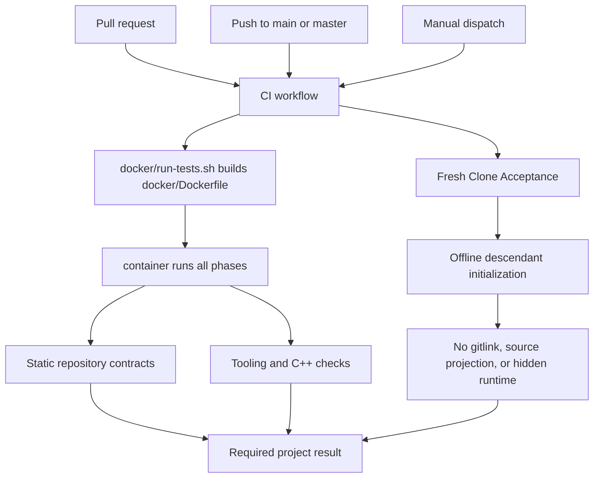

# GitHub Actions design

This document defines the repository-owned GitHub Actions graph. Template CI
validates only the parent project and does not start external tool runtimes or
read credentials for another repository.

## Workflow inventory

The sole tracked workflow source is `.github/workflows/ci.yml`.
GitHub-managed dynamic records remain outside this repository-owned graph:
`dynamic/github-code-scanning/codeql`, `dynamic/dependabot/update-graph`, and
`dynamic/copilot-swe-agent/copilot`.

| Workflow | Job | Responsibility |
| --- | --- | --- |
| `CI` | `Repository CI` | source-free/static contracts, one project image build, and `test/testrunner.sh` inside that image |
| `CI` | `Fresh Clone Acceptance` | offline template initialization and source-free descendant readback |

The workflow uses `permissions: contents: read`, disables persisted checkout
credentials, and cancels older executions for the same ref.

## Event and execution flow



### Repository CI

1. Check out the project without recursive submodules or persisted credentials.
2. Run `docker/run-tests.sh`, which builds one self-contained project image from
   `docker/Dockerfile` without invoking the test runner on the Host checkout.
3. Run the complete `all` phase of `test/testrunner.sh` inside that disposable
   image. Static and portable failures retain their test-list
   `environment_owner` and `responsibility` classification.
4. Let the script's trap remove the exact CI image on success, failure, or
   interruption; it refuses to overwrite a pre-existing tag.

The job does not install a second Host Python environment or give test commands
write capability to the caller checkout. Project source is copied at build time,
so no workspace/test mount or Docker socket is required at run time. The phase
classification remains available for direct focused checks, but the Docker
validation path has one source snapshot and one execution boundary.

### Fresh Clone Acceptance

The second job creates an isolated local bare remote and descendant clone,
runs offline template initialization, commits the result, and validates the
source-free tree. It deliberately does not rebuild the project image: container
execution is already owned once by `Repository CI`.

## Required checks and security

Protected `main` should require `Repository CI` and `Fresh Clone Acceptance`.
Neither job forwards GitHub tokens, SSH agents, Docker credentials, or project
secrets into the project container. GPU access is
not a CI prerequisite.

## Validation

```bash
bash test/testrunner.sh
bash docker/run-tests.sh --tag project-template:docs-check
git diff --check
```
