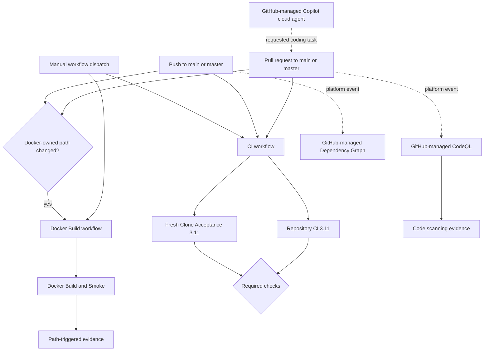

<!--
@dependency-start
contract design
responsibility Defines GitHub Actions ownership, triggers, job flow, required checks, permissions, and platform-managed boundaries for this repository.
upstream design ../contracts/template-validation.md project-owned validation entrypoints
upstream design ../contracts/template-github-remote.md branch-protection and publication boundary
upstream implementation ../../.github/workflows/ci.yml canonical repository and descendant validation workflow
upstream implementation ../../.github/workflows/docker-build.yml canonical Docker build and smoke workflow
upstream reference GitHub Actions repository workflow registry and main branch protection readback
downstream implementation ../../tools/check_github_workflows.py validates canonical workflow and design-document wiring
@dependency-end
-->

# GitHub Actions design

## Scope and source of truth

この文書は `project_template` のGitHub Actionsを、default branchの正本、GitHubが管理する
dynamic workflow、topic branchだけに存在する一時workflowに分けます。repositoryが所有する
正本は `main` の `.github/workflows/` にtrackedされたYAMLだけです。GitHub Actions APIの
`active` stateは、default branchの正本であることを意味しません。

以下のremote inventoryとbranch protectionは2026-08-19のreadbackです。動的なrun結果を
設計正本にはせず、workflow path、owner、trigger、required contextを判断する観測値として
記録します。

## Complete inventory

### Default-branch canonical workflows

| Workflow       | Workflow ID | Tracked path                         | Triggers                                                                | Jobs / status contexts                                  | Owner              |
| -------------- | ----------- | ------------------------------------ | ----------------------------------------------------------------------- | ------------------------------------------------------- | ------------------ |
| `CI`           | `271181376` | `.github/workflows/ci.yml`           | `push` and `pull_request` for `main`/`master`; `workflow_dispatch`      | `Repository CI (3.11)`; `Fresh Clone Acceptance (3.11)` | project validation |
| `Docker Build` | `271181378` | `.github/workflows/docker-build.yml` | Docker-owned path changes on `push`/`pull_request`; `workflow_dispatch` | `Docker Build and Smoke`                                | Docker environment |

### GitHub-managed dynamic workflows

| Workflow              | Workflow ID | API path                              | Repository YAML | Role                                                                         |
| --------------------- | ----------- | ------------------------------------- | --------------- | ---------------------------------------------------------------------------- |
| `CodeQL`              | `281591114` | `dynamic/github-code-scanning/codeql` | none            | GitHub code-scanning default setup; observed `actions` and `python` analysis |
| `Dependency Graph`    | `271182114` | `dynamic/dependabot/update-graph`     | none            | GitHub dependency graph maintenance                                          |
| `Copilot cloud agent` | `277687546` | `dynamic/copilot-swe-agent/copilot`   | none            | GitHub-managed Copilot coding-agent execution                                |

これらのtrigger、permissions、retention、versionはGitHub側が所有します。repository checkerは
tracked YAMLとrequired contextを検証し、dynamic workflowの内部実装を複製しません。

### Active API registrations absent from `main`

次のworkflowはGitHub Actions APIで`active`ですが、default branch `main` のtreeには存在しません。
topic branchにworkflow fileがあるため、そのbranchのpushまたはpull requestで実行されたものです。
Templateのcanonical validation、required context、bootstrap契約には含めません。

| Workflow                                    | Workflow ID | Path                                                     | Observed branch                           | Event boundary                    |
| ------------------------------------------- | ----------- | -------------------------------------------------------- | ----------------------------------------- | --------------------------------- |
| `Authoritatively finalize Issue 182`        | `337597268` | `.github/workflows/issue-182-authoritative-finalize.yml` | `fix/182-remove-agent-definitions`        | branch `push`                     |
| `Authoritatively finalize Issue 182 v2`     | `337598150` | `.github/workflows/issue-182-authoritative-v2.yml`       | `fix/182-remove-agent-definitions`        | branch `push`                     |
| `Authoritatively finalize Issue 182 v3`     | `337598985` | `.github/workflows/issue-182-authoritative-v3.yml`       | `fix/182-remove-agent-definitions`        | branch `push`                     |
| `Authoritatively finalize Issue 182 v4`     | `337605064` | `.github/workflows/issue-182-authoritative-v4.yml`       | `fix/182-remove-agent-definitions`        | branch `push`                     |
| `Authoritatively finalize Issue 182 v5`     | `337605794` | `.github/workflows/issue-182-authoritative-v5.yml`       | `fix/182-remove-agent-definitions`        | branch `push`                     |
| `Finalize Issue 182 responsibility fix`     | `337595629` | `.github/workflows/issue-182-finalize.yml`               | `fix/182-remove-agent-definitions`        | branch `push`                     |
| `Issue 182 source export`                   | `337543019` | `.github/workflows/issue-182-source-export.yml`          | `fix/182-remove-agent-definitions`        | branch `push` and PR to `main`    |
| `Supersede responsibility-violating PR 181` | `337596825` | `.github/workflows/issue-182-supersede-181.yml`          | `fix/182-remove-agent-definitions`        | branch `push` and manual dispatch |
| `Issue 775 source export`                   | `337060627` | `.github/workflows/issue-775-source-export.yml`          | `refactor/775-direct-luna-skill-dispatch` | branch `push` and PR to `main`    |

表示名は2026-08-19のGitHub Actions API readbackであり、topic branch上の`name:`変更と一致しない
場合があります。Issue #182の8 workflowは、同じbranchを更新し、validation、push、Issue/PR mutationを行う
one-time automationの複数versionです。`contents: write`、`issues: write`、
`pull-requests: write`を持つものがあります。これらはmainの設計ではなくbranch-localな
side effect ownerです。mainへmergeするworkflow、required check、恒久的なtemplate機能として
扱いません。Issue #775 workflowはread-only checkoutとartifact uploadを行うbranch-local exportです。

## Canonical event flow



Branch-local Issue workflowはこのflowへ接続しません。各topic branchの一時的なmutation ownerであり、
default branchのvalidation graphとは別です。

## `CI` workflow

### Trigger and authority

- `push`: `main`、`master`
- `pull_request`: `main`、`master`
- `workflow_dispatch`: manual
- workflow permission: `contents: read`
- concurrency: `ci-${{ github.workflow }}-${{ github.ref }}`
- newer runが同じgroupへ入ると、古いrunをcancelします。

両jobとも`ubuntu-latest`とPython 3.11を使います。`actions/checkout@v4`は
`persist-credentials: false`で、submoduleを初期化しません。

### `Repository CI (3.11)`

1. repositoryをcheckoutする。
1. `actions/setup-python@v5`でPython 3.11とpip cacheを設定する。
1. `bash docker/install_python_dependencies.sh "$PWD"`でproject dependenciesをinstallする。
1. `make pr-check`を実行する。

`make pr-check`はruntime-independence、Markdown link、workflow ownership、C++/CTest、
`tests/tools`をproject-owned gateとして合成します。exact AgentCanon gitlinkは検証しますが、
checkout、credential、root runtime symlinkを要求しません。

### `Fresh Clone Acceptance (3.11)`

1. repositoryを通常checkoutし、Python 3.11とproject Python dependenciesを用意する。
1. `TEMPLATE_FRESH_CLONE_RUN_DOCKER=1 make fresh-clone-check`を実行する。
1. current templateを通常cloneし、AgentCanon checkoutを初期化せずにproject identityを変換する。
1. 変換treeをlocal bare remoteへpushし、そのremoteからdescendantを通常cloneする。
1. descendantで`make pr-check`を実行する。
1. generated CMake stateをcleanし、canonical `docker/Dockerfile`からimageをbuildする。
1. descendantをbind mountし、container内でdependenciesと`make pr-check`を実行する。
1. host checkoutに未追跡または変更済みfileが残らないことを確認する。

このjobはbootstrap、normal clone、project checks、Docker runtimeを一つのdescendant identityで
検証します。AgentCanon source checkoutの内容やroot viewは検証対象ではありません。
Host C++ checkはCMakeのdefault generatorを使うため、workflowでNinjaを追加installしません。
Docker buildは`docker/Dockerfile`が所有する`CMAKE_GENERATOR=Ninja`と`ninja-build`を使います。

## `Docker Build` workflow

### Trigger paths

PRまたは`main`/`master`へのpushで、次のpathが変わった場合だけ実行します。

- `docker/**`
- `pyproject.toml`
- `.dockerignore`
- `.devcontainer/**`
- `tools/check_runtime_independence.py`
- `.github/workflows/docker-build.yml`

manual dispatchも可能です。permissionは`contents: read`、concurrency groupは
`docker-build-${{ github.ref }}`で、同じrefの古いrunをcancelします。

### `Docker Build and Smoke`

1. credentialを保持せずにcheckoutする。
1. `python3 tools/check_runtime_independence.py`を実行する。
1. `bash docker/check_zero_build_contract.sh`でDocker source-of-truthを検証する。
1. `bash docker/cold-build-smoke.sh --pull --no-cache --expect-non-default-id --tag project-template:ci-zero-build`を実行する。

このjobはcold buildとruntime smokeを一回だけ所有します。image publicationやregistry pushは行いません。

## Required checks and branch protection

2026-08-19の`main` branch protection readbackは`strict: true`で、次の2 contextを要求しています。

- `Repository CI (3.11)`
- `Fresh Clone Acceptance (3.11)`

required approving review countは0、stale review dismissalとadmin enforcementは有効です。
`Docker Build and Smoke`とCodeQLは重要なevidenceですが、branch protectionのrequired status
contextには登録されていません。Docker checkはpath filterで選択されます。

## Security and side-effect boundary

- canonical workflowは`contents: read`だけを持ち、Issue、PR、branchを変更しません。
- checkout credentialは保持しません。
- default validationはsubmodule checkout、recursive clone、AgentCanon tokenを要求しません。
- Docker workflowはlocal runner imageを作りますがregistryへpushしません。
- branch-local Issue workflowのwrite permissionとremote mutationは、そのtopic branchの一時責務です。
- dynamic workflowはGitHub platform ownerであり、tracked YAMLの権限モデルへ投影しません。

## Validation and readback

Tracked workflowまたはこの設計を変更した場合は、少なくとも次を実行します。

```bash
make github-workflow-check
make docs-check
make pr-check
git diff --check
```

remote stateは必要なときだけ次で読み戻します。

```bash
gh workflow list --repo iwashita-nozomu/project_template --all
gh pr checks <pr-number> --repo iwashita-nozomu/project_template
gh api repos/iwashita-nozomu/project_template/branches/main/protection
```

Workflow名、job名、trigger、permission、required contextを変更する場合は、YAML、checker、
この設計文書、branch protection readbackを同じchangeとして確認します。
