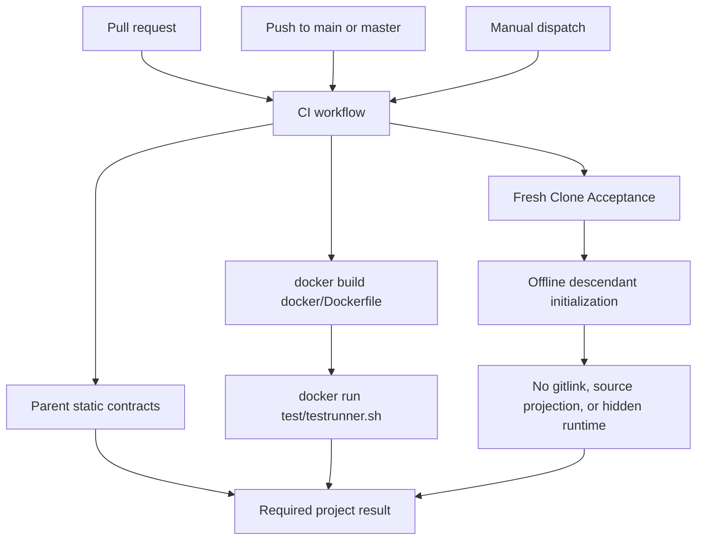

# GitHub Actions design

This document defines the repository-owned GitHub Actions graph. Template CI
validates only the parent project; it never checks out AgentCanon, starts its
tool runtime, publishes evals, or reads credentials for another repository.

## Workflow inventory

The sole tracked workflow source is `.github/workflows/ci.yml`.
GitHub-managed dynamic records remain outside this repository-owned graph:
`dynamic/github-code-scanning/codeql`, `dynamic/dependabot/update-graph`, and
`dynamic/copilot-swe-agent/copilot`.

| Workflow | Job | Responsibility |
| --- | --- | --- |
| `CI` | `Repository CI` | source-free/static contracts, one project image build, and `test/testrunner.sh` inside that image |
| `CI` | `Fresh Clone Acceptance` | offline template initialization and source-free descendant readback |

The workflow uses `permissions: contents: read`, disables persisted checkout
credentials, and cancels older executions for the same ref.

## Event and execution flow



### Repository CI

1. Check out the project without recursive submodules or persisted credentials.
2. Run the parent-owned runtime-independence, documentation, workflow, and
   Docker contract checks on the runner.
3. Build one self-contained project image from `docker/Dockerfile`.
4. Run `test/testrunner.sh` inside that image. The TOML list owns the parent
   Python and C++ commands and reports `environment_owner=project-container`
   and `responsibility=parent-repository` on failure.
5. Remove the exact CI image in an `always()` cleanup step.

The job does not install a second Host Python environment or run the same test
list on both Host and container. Project source is copied at build time, so no
workspace/test mount or Docker socket is required at run time.

### Fresh Clone Acceptance

The second job creates an isolated local bare remote and descendant clone,
runs offline template initialization, commits the result, and validates the
source-free tree. It deliberately does not rebuild the project image: container
execution is already owned once by `Repository CI`.

## Required checks and security

Protected `main` should require `Repository CI` and `Fresh Clone Acceptance`.
Neither job forwards GitHub tokens, SSH agents, Docker credentials, project
secrets, or AgentCanon capabilities into the project container. GPU access is
not a CI prerequisite.

## AgentCanon boundary

Optional AgentCanon work occurs only in the ignored
`workspace/agent-canondevelop/<qualified-task>/agent-canon` clone. Its
`bootstrap.sh` owns the shared tool image/container, isolated Codex home, eval
spool, and typed publication to
[`iwashita-nozomu/agent-canon-log`](https://github.com/iwashita-nozomu/agent-canon-log).
Those resources are not nodes in this project CI graph and are removed through
the AgentCanon closeout lifecycle.

## Validation

```bash
make github-workflow-check
make docs-check
make docker-check
docker build --platform linux/amd64 -f docker/Dockerfile -t project-template .
docker run --rm --platform linux/amd64 project-template test/testrunner.sh
git diff --check
```
